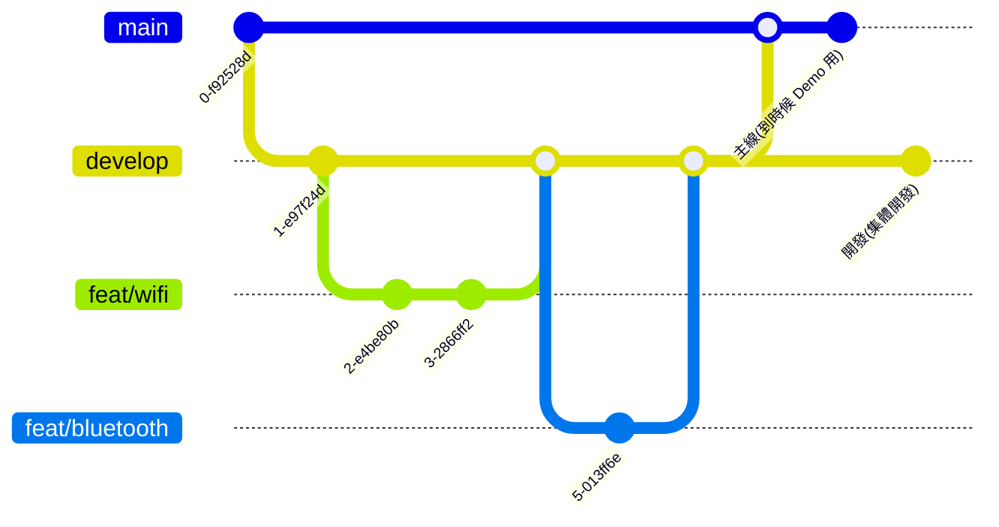

# TownPass-WEB-PersevereTeam

### 開發環境
1. React
2. node: v22.6.0
3. npm: 10.8.2

### Version History
1.0.0
提供初次接觸程式通的新手了解如何向 APP 進行雙向溝通


### CI/CD



### How to Start a new project
```
npx create-react-app persevere-web
```

### How to run a project
```
cd persevere-web
npm start
```

### 如何與 APP 互動
1. 更改 App.js 調用 useConnectionMessage 拿資料，useHandleConnectionData 接資料
    - src/hooks/useConnectionMessage 使用 web-view in APP 的 window.flutterObject 向 APP 調用資料
    - src/hooks/useHandleConnectionData Listen 回傳資料，並更新給 setUser
    - src/stores/user.ts 使用 useUserStore hook 來管理 user 狀態


### 其他相關設定
1. 新增 tsconfig 方便對齊 typescript file
2. 新增 port:2024 在 .env，方便 APP 對齊